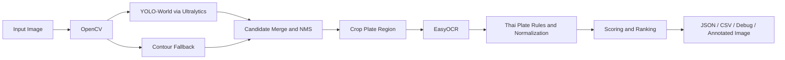
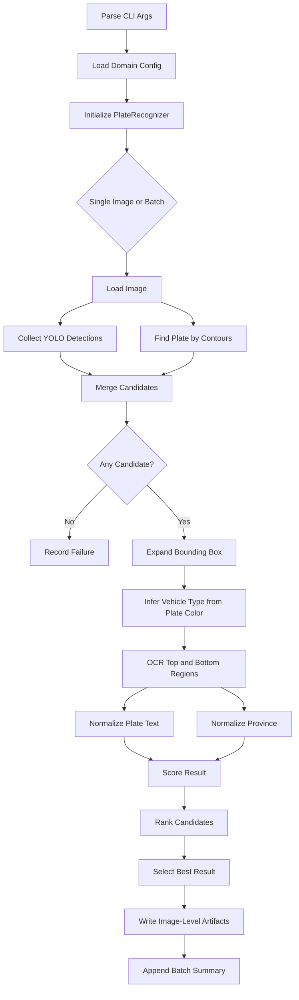
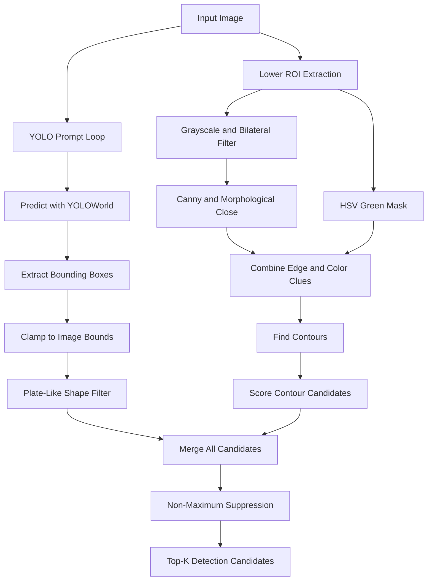
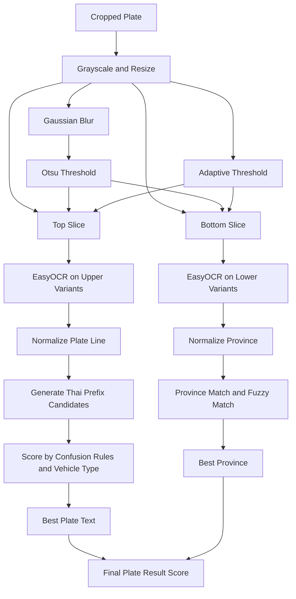
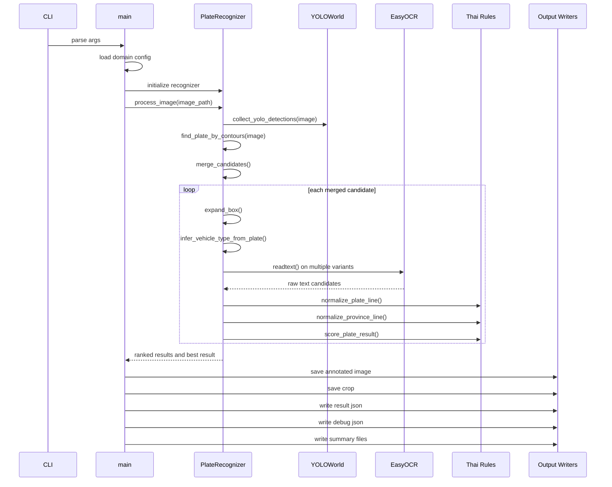
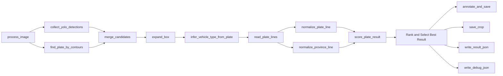
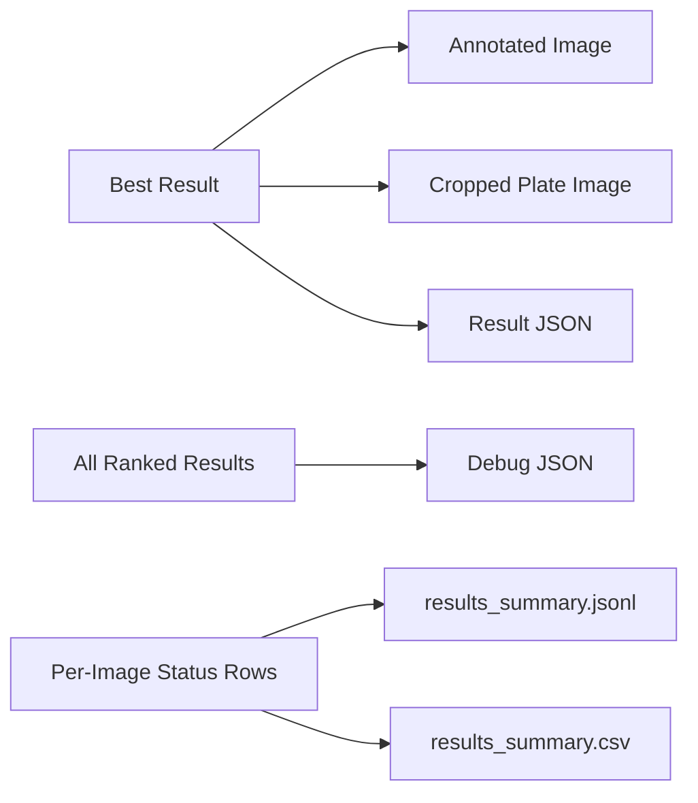

# Thai License Plate Recognition

ระบบตรวจจับและอ่านข้อความบนป้ายทะเบียนรถไทยจากภาพนิ่ง พร้อม pipeline สำหรับ detection, OCR, text normalization, scoring, และการส่งออกผลลัพธ์เพื่อใช้งานต่อ

Thai license plate detection and recognition from still images, with a complete pipeline for detection, OCR, Thai-specific text normalization, ranking, and output generation.

## Evaluation Mode

รองรับโหมดประเมินผลกับ ground truth CSV เพื่อใช้วัดคุณภาพก่อนขึ้น production จริง

คอลัมน์ที่รองรับใน CSV:

1. `image_path` จำเป็น
2. `plate_text` จำเป็น
3. `province` จำเป็น
4. `combined_text` ไม่จำเป็น ถ้าไม่ใส่ระบบจะสร้างจาก `plate_text + province`
5. `vehicle_type` ไม่จำเป็น แต่แนะนำสำหรับ leaderboard ต่อชนิดรถ
6. `bbox_x1`, `bbox_y1`, `bbox_x2`, `bbox_y2` ไม่จำเป็น แต่ถ้าใส่จะคำนวณ detection IoU และ `detection_iou_at_0_5`
7. `split_tag`, `view`, `lighting`, `distance_bucket`, `occlusion`, `scene` ไม่จำเป็น แต่แนะนำสำหรับ benchmark matrix และ slice leaderboard

ตัวอย่างไฟล์อยู่ที่ [ground_truth_sample.csv](ground_truth_sample.csv)

ตัวอย่างคำสั่ง:

```bash
/Users/kidpech/thai_license_plate/.venv/bin/python thai_license_plate.py --input-dir batch_input --recursive --ground-truth-csv ground_truth_sample.csv --output-basename batch_plate --no-debug
```

ไฟล์รายงานที่ได้:

1. `evaluation_report.json`
2. `evaluation_report.csv`
3. `evaluation_leaderboard.json`
4. `evaluation_leaderboard.csv`
5. `thai_char_confusion_report.json`
6. `thai_char_confusion_report.csv`
7. `results_summary.jsonl`
8. `results_summary.csv`

metric ที่รายงาน:

1. exact accuracy ของทะเบียน
2. exact accuracy ของจังหวัด
3. exact accuracy ของข้อความรวม
4. success rate, low confidence rate, failed rate
5. mean character error rate ของทะเบียน
6. mean character error rate ของจังหวัด
7. mean character error rate ของข้อความรวม
8. mean IoU ของ detection ถ้ามี bbox ground truth
9. detection success ที่ threshold `IoU >= 0.5`

leaderboard/report เพิ่มเติม:

1. per-province accuracy
2. per-vehicle-type accuracy
3. per-split, per-view, per-lighting, per-distance, per-occlusion, per-scene accuracy เมื่อมีข้อมูลใน CSV
4. Thai character confusion analysis สำหรับอักษรบนทะเบียน

## Production Status Contract

ผลลัพธ์ระดับภาพถูกจัดเป็น 3 สถานะเพื่อให้ระบบ downstream ตัดสินใจได้ง่ายขึ้น

1. `success` ใช้เมื่อรูปแบบทะเบียนสมบูรณ์, จังหวัดอยู่ในรายการจริง, และคะแนนรวมเกิน threshold
2. `low_confidence` ใช้เมื่อระบบอ่านได้บางส่วนหรือ confidence ไม่ถึงเกณฑ์ production แต่ยังมีข้อมูลพอให้ review ต่อได้
3. `failed` ใช้เมื่อไม่พบป้ายหรือ OCR/result quality ต่ำเกินไป

สถานะนี้ถูกเขียนลงในไฟล์ผลลัพธ์ JSON, `results_summary.csv`, `results_summary.jsonl`, และ evaluation reports

## Package Layout

โปรเจกต์ถูกแยกออกจาก single-file script ไปเป็น package จริงใน `plate_recognition/`

1. `config.py` สำหรับ CLI, logging, config loading, input iteration
2. `geometry.py` สำหรับ image geometry และ preprocessing
3. `normalization.py` สำหรับ OCR normalization, scoring, confidence gating
4. `recognizer.py` สำหรับ detector cascade, OCR orchestration, result ranking
5. `reporting.py` สำหรับ output artifacts
6. `evaluation.py` สำหรับ benchmark, IoU, CER, และ slice leaderboards
7. `cli.py` เป็น entrypoint orchestration

`thai_license_plate.py` ยังอยู่เป็น thin wrapper เพื่อคงคำสั่งเดิมไว้

## Detector Strategy

เวอร์ชันนี้เลิกยิง YOLO-World ทุก prompt แบบ flat ทั้งหมด แล้วเปลี่ยนเป็น prompt cascade

1. contour fallback ทำงานทุกครั้งเพื่อสร้าง candidate ราคาถูกก่อน
2. YOLO-World ทำงานเป็น batch ของ prompt ตามลำดับความน่าเชื่อถือ
3. ถ้าพบ strong YOLO candidate เกิน threshold ระบบจะหยุด cascade เร็วเพื่อลด latency
4. candidate ทั้งหมดถูก merge ด้วย NMS ก่อนเข้าสู่ OCR pipeline

## Language Navigation

- ภาษาไทย: เริ่มที่หัวข้อ `ภาพรวม`
- English: Start at `Overview (EN)`

## ภาพรวม

โปรเจกต์นี้ออกแบบเป็น single-file pipeline ใน `thai_license_plate.py` เพื่อให้ทดลอง, debug, และปรับ heuristic ได้เร็ว โดยใช้แนวคิดหลักดังนี้

1. ใช้ YOLO-World ค้นหา candidate ของป้ายทะเบียนจากหลาย prompts
2. ใช้ contour-based fallback เพื่อเพิ่มโอกาสเจอป้ายเมื่อ detector พลาด
3. ใช้ EasyOCR อ่านข้อความจาก crop ป้ายทะเบียนหลายรูปแบบภาพ
4. ใช้กฎเฉพาะโดเมนของป้ายทะเบียนไทยเพื่อ normalize ตัวอักษร, ตัวเลข, และจังหวัด
5. รวมคะแนนจาก detector confidence และความสมเหตุสมผลของข้อความ เพื่อเลือกผลลัพธ์ที่ดีที่สุด
6. รองรับทั้งภาพเดี่ยวและ batch processing พร้อม output เป็น JSON, JSONL, CSV และภาพ annotated

### เป้าหมายของโปรเจกต์

1. สร้าง baseline ที่อธิบายได้ง่ายและ debug ได้จริง
2. ลด false negative ด้วยการใช้ detector มากกว่าหนึ่งแนวทาง
3. ลด OCR error ด้วย post-processing ที่เข้าใจรูปแบบทะเบียนไทย
4. รองรับการวิเคราะห์ย้อนหลังผ่าน debug artifacts

## หลักการออกแบบ

### 1. Detection Redundancy

ระบบใช้สองแหล่งของ candidate พร้อมกัน

1. YOLO-World จาก prompts หลายคำ เช่น `license plate` และ `vehicle registration plate`
2. Contour-based ROI search ที่เน้นบริเวณล่างของรถและลักษณะสี่เหลี่ยมยาวแบบป้ายทะเบียน

แนวทางนี้ช่วยลดความเสี่ยงจากการพึ่ง detector แบบเดียว โดยเฉพาะในภาพที่มีแสงสะท้อน, มุมเอียง, หรือสีพื้นป้ายทำให้ semantic detection ไม่แม่น

### 2. Domain-Aware OCR

ผล OCR ภาษาไทยมักมีความสับสนของอักษรที่รูปร่างใกล้กัน เช่น `ต/ฑ/ฒ`, `บ/ป/ภ`, `ศ/ษ/ส` ดังนั้นระบบจึงไม่เชื่อผล OCR ตรง ๆ แต่สร้าง candidate หลายแบบจาก confusion groups แล้วให้คะแนนด้วยกฎของโดเมนจริง

### 3. Explainable Scoring

ผลลัพธ์สุดท้ายเกิดจากการรวมคะแนนของ

1. confidence ของ detector
2. ความถูกต้องของรูปแบบทะเบียน
3. ความน่าเชื่อถือของชื่อจังหวัด
4. ความสอดคล้องของ prefix กับ vehicle type

ทำให้ย้อน debug ได้จาก `*_debug.json` ว่าทำไม candidate หนึ่งชนะอีก candidate หนึ่ง

### 4. Config-Driven Rules

ค่าต่าง ๆ เช่น prompts, thresholds, จังหวัด, confusion groups, prefix และ valid two-letter series แยกไว้ใน `plate_config.json` เพื่อให้ปรับ heuristic ได้โดยไม่ต้องแก้ logic หลักทุกครั้ง

## Tech Stack

| Layer           | Technology             | หน้าที่                                            |
| --------------- | ---------------------- | -------------------------------------------------- |
| Language        | Python 3               | orchestration และ business logic                   |
| Computer Vision | OpenCV                 | โหลดภาพ, preprocess, contour detection, annotation |
| Detector        | Ultralytics YOLOWorld  | หา candidate ของป้ายทะเบียนจาก prompt              |
| OCR             | EasyOCR                | อ่านข้อความไทยและอังกฤษจากภาพ crop                 |
| Configuration   | JSON                   | เก็บ prompts, thresholds, จังหวัด, confusion rules |
| Outputs         | JSON, JSONL, CSV, JPEG | เก็บผลลัพธ์สุดท้าย, debug และ batch summary        |

## Tech Stack Diagram



## System Architecture

โครงสร้างตอนนี้เป็น script เดียว แต่แยกหน้าที่ชัดเจนเป็น 5 ส่วน

1. Config and CLI
2. Geometry and image preprocessing
3. Thai text normalization
4. Detection and recognition orchestration
5. Persistence and reporting



```mermaid
flowchart TB
    subgraph Config
        A1[parse_args]
        A2[setup_logging]
        A3[load_domain_config]
        A4[build_output_paths]
    end

    subgraph Geometry_and_Preprocess
        B1[load_image]
        B2[clamp_box]
        B3[expand_box]
        B4[is_plate_like]
        B5[preprocess_plate]
    end

    subgraph Thai_Text_Normalization
        C1[clean_text]
        C2[extract_plate_letters]
        C3[get_confusion_options]
        C4[score_confusion_resolution]
        C5[generate_plate_letter_candidates]
        C6[extract_series_prefix_digit]
        C7[score_letter_candidate]
        C8[normalize_plate_line]
        C9[normalize_province_line]
        C10[read_plate_lines]
        C11[score_plate_result]
    end

    subgraph Recognition
        D1[PlateRecognizer.__init__]
        D2[infer_vehicle_type_from_plate]
        D3[find_plate_by_contours]
        D4[collect_yolo_detections]
        D5[merge_candidates]
        D6[process_image]
    end

    subgraph Output
        E1[annotate_and_save]
        E2[save_crop]
        E3[write_result_json]
        E4[write_debug_json]
        E5[write_summary_files]
        E6[iter_input_images]
        E7[main]
    end

    A1 --> E7
    A2 --> E7
    A3 --> D1
    A4 --> E7
    B1 --> D6
    B2 --> B3
    B3 --> D6
    B4 --> D3
    B4 --> D4
    B5 --> C10
    C1 --> C8
    C1 --> C9
    C2 --> C5
    C3 --> C4
    C3 --> C5
    C4 --> C7
    C5 --> C8
    C6 --> C8
    C7 --> C8
    C8 --> C10
    C9 --> C10
    C10 --> C11
    D2 --> D6
    D3 --> D6
    D4 --> D6
    D5 --> D6
    D6 --> E1
    D6 --> E2
    D6 --> E3
    D6 --> E4
    E6 --> E7
    E7 --> E5
```

## End-to-End Runtime Flow



## Detailed Detection Flow



### แนวคิดของ detection

1. YOLO-World ช่วยหา region จาก semantic meaning ของป้าย
2. Contour fallback ช่วยในกรณีที่กรอบป้ายชัด แต่ model ไม่มั่นใจ
3. `is_plate_like` ใช้กรองกล่องที่ไม่เหมือนป้ายเพื่อลดภาระ OCR
4. NMS ใช้รวม candidate จากสองแหล่งให้เหลือชุดที่ไม่ซ้ำกันมากเกินไป

## OCR and Normalization Flow



### แนวคิดของ OCR และ normalization

1. ระบบใช้ภาพหลาย variant เพื่อเพิ่มโอกาสให้ OCR อ่านได้ในสภาพแสงต่างกัน
2. บรรทัดบนและล่างถูกอ่านแยกกัน เพราะหน้าที่ต่างกัน
3. บรรทัดบนถูก normalize ด้วยกฎของ prefix ไทยและรูปแบบเลขทะเบียน
4. บรรทัดล่างถูก normalize ด้วยรายการจังหวัดจริงและ fuzzy matching

## Sequence Diagram



## Function Interaction Diagram



## Output Artifact Flow



## Function Reference

### Configuration and CLI

| Function             | Responsibility                                                             |
| -------------------- | -------------------------------------------------------------------------- |
| `setup_logging`      | ตั้งค่า logging level และรูปแบบข้อความ log                                 |
| `load_domain_config` | โหลด JSON config และแปลง confusion groups / series prefixes ให้พร้อมใช้งาน |
| `parse_args`         | แปลง CLI arguments เป็น `AppConfig`                                        |
| `build_output_paths` | สร้าง path ของไฟล์ output ตามชื่อภาพและ basename                           |

### Geometry and Image Preparation

| Function           | Responsibility                                                    |
| ------------------ | ----------------------------------------------------------------- |
| `load_image`       | อ่านไฟล์ภาพจาก disk และ fail เร็วหากเปิดไม่ได้                    |
| `clamp_box`        | บังคับ bounding box ไม่ให้ออกนอกขนาดภาพ                           |
| `expand_box`       | ขยายกล่องที่ตรวจพบเพื่อเก็บ margin ให้ OCR อ่านง่ายขึ้น           |
| `is_plate_like`    | กรองกล่องด้วย aspect ratio และ relative area                      |
| `preprocess_plate` | สร้างภาพ grayscale, enlarged, Otsu, adaptive threshold สำหรับ OCR |

### Thai Text Normalization

| Function                           | Responsibility                                              |
| ---------------------------------- | ----------------------------------------------------------- |
| `clean_text`                       | ล้าง whitespace จากผล OCR                                   |
| `extract_plate_letters`            | ดึงเฉพาะอักษรไทยจากข้อความ                                  |
| `get_confusion_options`            | คืนชุดตัวอักษรที่อาจสับสนกันตาม config                      |
| `score_confusion_resolution`       | ให้คะแนน candidate ตามความใกล้เคียงกับอักษร OCR เดิม        |
| `generate_plate_letter_candidates` | แตก candidate จาก confusion groups ของ prefix ไทย           |
| `extract_series_prefix_digit`      | แยกเลขนำหน้าพิเศษหากมี                                      |
| `score_letter_candidate`           | ให้คะแนน prefix ตาม vehicle type และคุณภาพ candidate        |
| `normalize_plate_line`             | สร้างและเลือกบรรทัดทะเบียนที่ดีที่สุดจาก OCR หลาย candidate |
| `normalize_province_line`          | map ชื่อจังหวัดจาก OCR ให้ตรงกับรายชื่อจังหวัดจริง          |
| `read_plate_lines`                 | OCR หลาย variant แล้วแยกผลเป็นบรรทัดบนและล่าง               |
| `score_plate_result`               | ให้คะแนนผลลัพธ์รวมจากรูปแบบทะเบียนและจังหวัด                |

### Recognition Orchestration

| Method                          | Responsibility                                                                    |
| ------------------------------- | --------------------------------------------------------------------------------- |
| `PlateRecognizer.__init__`      | โหลด YOLO-World และ EasyOCR runtime                                               |
| `infer_vehicle_type_from_plate` | เดาประเภทรถจากสีป้ายเมื่อผู้ใช้เลือก `auto`                                       |
| `find_plate_by_contours`        | หา candidate ป้ายจาก contour และ ROI ด้านล่างของรถ                                |
| `collect_yolo_detections`       | ยิง YOLO-World หลาย prompt แล้วรวม detection                                      |
| `merge_candidates`              | ใช้ NMS เพื่อลดกล่องซ้ำและคัด top candidates                                      |
| `process_image`                 | pipeline หลักตั้งแต่ detect, crop, OCR, normalize, score ไปจนถึงเลือก best result |

### Persistence and Batch Reporting

| Function              | Responsibility                                          |
| --------------------- | ------------------------------------------------------- |
| `annotate_and_save`   | วาดกรอบและข้อความลงภาพผลลัพธ์                           |
| `save_crop`           | บันทึกภาพ crop ของป้ายทะเบียน                           |
| `write_result_json`   | บันทึกผลลัพธ์สุดท้ายของภาพเดียว                         |
| `write_debug_json`    | บันทึก candidate และ ranking ทั้งหมดเพื่อ debug         |
| `write_summary_files` | สร้าง `results_summary.jsonl` และ `results_summary.csv` |
| `is_valid_image`      | ตรวจว่านามสกุลไฟล์รองรับหรือไม่                         |
| `iter_input_images`   | สร้าง iterator สำหรับ single image หรือ batch input     |
| `main`                | entry point ของโปรแกรมและตัวควบคุม flow ทั้งหมด         |

## Configuration Model

ไฟล์ `plate_config.json` ควบคุมพฤติกรรมของระบบ เช่น

1. detection prompts
2. confidence threshold
3. image size
4. crop padding
5. lower ROI ratios
6. เกณฑ์สีเขียวและสีฟ้าที่ใช้ infer ประเภทรถ
7. รายชื่อจังหวัดไทย
8. prefix ของป้ายตามประเภทรถ
9. valid two-letter series ที่ยืนยันแล้วตามประเภทรถ
10. confusion groups ของตัวอักษรไทย

## Input and Output

### Input

1. ภาพเดี่ยวผ่าน `--image`
2. หลายภาพผ่าน `--input-dir`
3. model weights `yolov8s-worldv2.pt`
4. domain config `plate_config.json`

### Output Artifacts

| File Pattern            | Meaning                                             |
| ----------------------- | --------------------------------------------------- |
| `*_annotated.jpeg`      | ภาพต้นฉบับที่วาดกรอบและข้อความผลลัพธ์แล้ว           |
| `*_crop.jpeg`           | crop ของป้ายทะเบียน                                 |
| `*.json`                | ผลลัพธ์สุดท้ายของภาพนั้น                            |
| `*_debug.json`          | candidate และ ranking ทั้งหมดเพื่อวิเคราะห์ย้อนหลัง |
| `results_summary.jsonl` | สรุปผลแบบ machine-friendly สำหรับ batch             |
| `results_summary.csv`   | สรุปผลแบบตาราง                                      |

### Example Result

จากข้อมูลตัวอย่างใน repo ตอนนี้ ระบบให้ผลดังนี้

1. Plate: `ฒก 8534`
2. Province: `กรุงเทพมหานคร`
3. Vehicle type: `private_pickup`
4. Source: `contour fallback`

## การใช้งาน

### ติดตั้ง dependencies

```bash
python -m venv .venv
source .venv/bin/activate
pip install -r requirements.txt
```

### Run single image

```bash
python thai_license_plate.py --image car_image.jpg
```

### Run single image without debug JSON

```bash
python thai_license_plate.py --image car_image.jpg --no-debug
```

### Run batch directory

```bash
python thai_license_plate.py --input-dir batch_input --output-basename batch_plate
```

### Force a vehicle type

```bash
python thai_license_plate.py --image car_image.jpg --vehicle-type private_pickup
```

## โครงสร้างไฟล์

```text
thai_license_plate/
├── thai_license_plate.py
├── plate_config.json
├── yolov8s-worldv2.pt
├── car_image.jpg
├── batch_input/
├── requirements.txt
├── .gitignore
└── README.md
```

## ข้อจำกัด

1. โค้ดหลักยังรวมอยู่ในไฟล์เดียว ทำให้ scale เป็น package ยากขึ้น
2. heuristic ปัจจุบันออกแบบกับป้ายไทยส่วนบุคคลเป็นหลัก
3. EasyOCR และ rule-based normalization ยังอาจพลาดในภาพเบลอ, เอียงมาก, หรือแสงสะท้อนสูง
4. ยังไม่มี automated tests สำหรับ regression ของ OCR และ normalization

## แนวทางพัฒนาต่อ

1. แยก `thai_license_plate.py` เป็น modules เช่น `config`, `detection`, `ocr`, `normalization`, `io`
2. เพิ่ม test fixtures สำหรับ plate text normalization
3. เพิ่ม benchmark dataset เพื่อวัด precision/recall และ OCR exact match
4. พิจารณาเก็บ model weights แยกจาก source code หาก repo โตขึ้น

---

## Overview (EN)

This project is a single-file pipeline implemented in `thai_license_plate.py` to keep experimentation, debugging, and heuristic tuning simple and fast. Its main ideas are:

1. Use YOLO-World with multiple prompts to find license plate candidates
2. Use contour-based fallback to recover candidates when the detector misses them
3. Run EasyOCR on multiple processed variants of the cropped plate region
4. Apply Thai domain rules to normalize plate text, province names, and candidate prefixes
5. Combine detector confidence with domain plausibility scoring to rank final results
6. Support both single-image and batch processing with JSON, JSONL, CSV, and annotated-image outputs

### Project Goals

1. Build a practical and explainable baseline
2. Reduce false negatives with multiple detection strategies
3. Reduce OCR noise with Thai-specific post-processing
4. Keep debugging and auditability straightforward through saved artifacts

## Design Principles (EN)

### 1. Detection Redundancy

The system uses two candidate sources in parallel:

1. YOLO-World with prompts such as `license plate` and `vehicle registration plate`
2. A contour-based ROI search focused on the lower vehicle area and elongated rectangular regions

This reduces the risk of depending on a single detector, especially for reflective, tilted, or visually noisy images.

### 2. Domain-Aware OCR

Thai OCR often confuses visually similar characters, such as `ต/ฑ/ฒ`, `บ/ป/ภ`, and `ศ/ษ/ส`. Instead of trusting OCR output directly, the pipeline expands candidate characters from configured confusion groups and scores them using real Thai plate rules.

### 3. Explainable Scoring

The final score combines:

1. detector confidence
2. plate format plausibility
3. province validity
4. prefix compatibility with the inferred or requested vehicle type

This makes ranking decisions inspectable in the saved debug JSON.

### 4. Config-Driven Rules

Prompts, thresholds, province lists, confusion groups, valid series prefixes, and verified two-letter series are defined in `plate_config.json`, so heuristics can be tuned without rewriting the main runtime logic.

## Tech Stack (EN)

| Layer           | Technology             | Purpose                                                     |
| --------------- | ---------------------- | ----------------------------------------------------------- |
| Language        | Python 3               | Orchestration and business logic                            |
| Computer Vision | OpenCV                 | Image loading, preprocessing, contour detection, annotation |
| Detector        | Ultralytics YOLOWorld  | Prompt-based plate candidate detection                      |
| OCR             | EasyOCR                | Thai and English text extraction                            |
| Configuration   | JSON                   | Thresholds, prompts, provinces, and confusion rules         |
| Outputs         | JSON, JSONL, CSV, JPEG | Result storage, debug artifacts, and batch summaries        |

## Architecture Notes (EN)

Although the implementation is currently in one script, the code is logically separated into five responsibilities:

1. Config and CLI handling
2. Geometry and image preprocessing
3. Thai text normalization
4. Detection and recognition orchestration
5. Persistence and reporting

The Mermaid diagrams above already reflect the detailed runtime structure, detection flow, OCR normalization flow, sequence of interactions, and output artifact generation.

## Function Reference (EN)

### Configuration and CLI

| Function             | Responsibility                                                                 |
| -------------------- | ------------------------------------------------------------------------------ |
| `setup_logging`      | Configure log level and message format                                         |
| `load_domain_config` | Load JSON configuration and transform confusion groups and series prefix rules |
| `parse_args`         | Convert CLI arguments into `AppConfig`                                         |
| `build_output_paths` | Create output paths for image-level artifacts                                  |

### Geometry and Image Preparation

| Function           | Responsibility                                                     |
| ------------------ | ------------------------------------------------------------------ |
| `load_image`       | Read an image from disk and fail fast if it cannot be opened       |
| `clamp_box`        | Keep a bounding box inside the image boundaries                    |
| `expand_box`       | Add margin around a detected box before OCR                        |
| `is_plate_like`    | Filter regions using aspect ratio and relative area heuristics     |
| `preprocess_plate` | Produce grayscale, enlarged, Otsu, and adaptive-threshold variants |

### Thai Text Normalization

| Function                           | Responsibility                                                 |
| ---------------------------------- | -------------------------------------------------------------- |
| `clean_text`                       | Normalize OCR whitespace                                       |
| `extract_plate_letters`            | Keep only Thai letters from OCR text                           |
| `get_confusion_options`            | Return valid confusion-group alternatives for a character      |
| `score_confusion_resolution`       | Score how closely a candidate matches the original OCR letters |
| `generate_plate_letter_candidates` | Expand Thai plate prefix candidates from confusion groups      |
| `extract_series_prefix_digit`      | Extract optional leading series digits                         |
| `score_letter_candidate`           | Score a letter candidate using vehicle-type rules              |
| `normalize_plate_line`             | Build and choose the best plate line candidate                 |
| `normalize_province_line`          | Resolve province text against real Thai provinces              |
| `read_plate_lines`                 | OCR multiple variants and split upper and lower text logic     |
| `score_plate_result`               | Score final plausibility of plate text and province            |

### Recognition Orchestration

| Method                          | Responsibility                                                    |
| ------------------------------- | ----------------------------------------------------------------- |
| `PlateRecognizer.__init__`      | Load YOLO-World and EasyOCR runtimes                              |
| `infer_vehicle_type_from_plate` | Infer vehicle type from plate color when `auto` is used           |
| `find_plate_by_contours`        | Generate plate candidates from lower-ROI contour analysis         |
| `collect_yolo_detections`       | Run YOLO-World across multiple prompts and collect detections     |
| `merge_candidates`              | Apply NMS and keep the strongest unique candidates                |
| `process_image`                 | Run the end-to-end recognition pipeline and return ranked results |

### Persistence and Batch Reporting

| Function              | Responsibility                                          |
| --------------------- | ------------------------------------------------------- |
| `annotate_and_save`   | Save the annotated image                                |
| `save_crop`           | Save the cropped plate image                            |
| `write_result_json`   | Save the final per-image result JSON                    |
| `write_debug_json`    | Save ranked candidates and debug details                |
| `write_summary_files` | Write `results_summary.jsonl` and `results_summary.csv` |
| `is_valid_image`      | Check whether a file is a supported input image         |
| `iter_input_images`   | Iterate over a single image or a batch directory        |
| `main`                | Program entry point and top-level orchestrator          |

## Configuration Model (EN)

`plate_config.json` controls key runtime behavior, including:

1. detection prompts
2. confidence threshold
3. image size
4. crop padding
5. lower ROI ratios
6. green and blue color thresholds for vehicle type inference
7. Thai province names
8. valid plate-series prefixes by vehicle type
9. verified valid two-letter series by vehicle type
10. Thai character confusion groups

## Inputs and Outputs (EN)

### Inputs

1. A single image via `--image`
2. A directory of images via `--input-dir`
3. Model weights in `yolov8s-worldv2.pt`
4. Domain rules in `plate_config.json`

### Output Artifacts

| File Pattern            | Meaning                                                      |
| ----------------------- | ------------------------------------------------------------ |
| `*_annotated.jpeg`      | Original image with the selected plate region and final text |
| `*_crop.jpeg`           | Cropped plate image                                          |
| `*.json`                | Final per-image result                                       |
| `*_debug.json`          | Ranked candidates and intermediate debug information         |
| `results_summary.jsonl` | Machine-friendly batch summary                               |
| `results_summary.csv`   | Tabular batch summary                                        |

### Example Result

Based on the sample artifacts currently in the repository, the system resolves:

1. Plate: `ฒก 8534`
2. Province: `กรุงเทพมหานคร`
3. Vehicle type: `private_pickup`
4. Source: `contour fallback`

## Usage (EN)

### Install dependencies

```bash
python -m venv .venv
source .venv/bin/activate
pip install -r requirements.txt
```

### Run a single image

```bash
python thai_license_plate.py --image car_image.jpg
```

### Run a single image without debug JSON

```bash
python thai_license_plate.py --image car_image.jpg --no-debug
```

### Run a batch directory

```bash
python thai_license_plate.py --input-dir batch_input --output-basename batch_plate
```

### Force a vehicle type

```bash
python thai_license_plate.py --image car_image.jpg --vehicle-type private_pickup
```

## Repository Layout (EN)

```text
thai_license_plate/
├── thai_license_plate.py
├── plate_config.json
├── yolov8s-worldv2.pt
├── car_image.jpg
├── batch_input/
├── requirements.txt
├── .gitignore
└── README.md
```

## Limitations (EN)

1. The core logic is still packaged in one script, which makes larger-scale extension harder
2. The current heuristics are mainly tuned for common Thai private vehicle plates
3. EasyOCR and rule-based normalization can still fail on blurry, heavily skewed, or reflective images
4. There are no automated regression tests yet for OCR and normalization behavior

## Recommended Next Steps (EN)

1. Split `thai_license_plate.py` into modules such as `config`, `detection`, `ocr`, `normalization`, and `io`
2. Add normalization-focused test fixtures
3. Build a benchmark dataset for detection precision/recall and OCR exact-match evaluation
4. Consider storing model weights separately from source code if the repository grows
