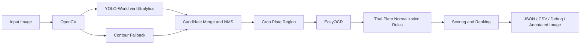
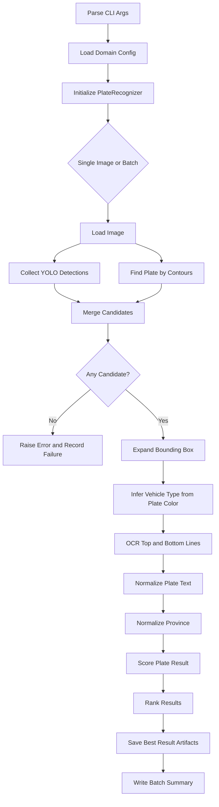
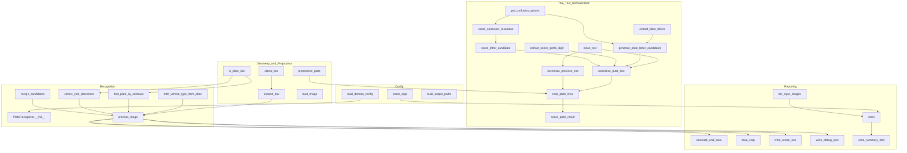
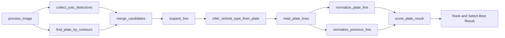

# Thai License Plate Recognition

ระบบตรวจจับและอ่านข้อความบนป้ายทะเบียนรถไทยจากภาพนิ่ง โดยใช้ YOLO-World สำหรับหา candidate ของป้ายทะเบียน, ใช้ contour-based fallback สำหรับกรณี model หาไม่เจอหรือหาได้ไม่แม่นพอ, และใช้ EasyOCR + กฎเฉพาะโดเมนของป้ายทะเบียนไทยเพื่อ normalize ข้อความให้ใกล้ผลลัพธ์จริงมากที่สุด

## Overview

โปรเจกต์นี้ออกแบบเป็น single-file pipeline ใน [thai_license_plate.py](thai_license_plate.py) เพื่อให้ทดลอง, debug, และปรับ heuristic ได้เร็ว โดยเน้นหลักการดังนี้

1. ใช้โมเดลตรวจจับเชิง semantic ก่อน เพื่อหา region ที่น่าจะเป็นป้ายทะเบียน
2. มี contour fallback เพื่อเพิ่ม robustness เมื่อ YOLO ให้ false negative
3. OCR ไม่ถูกเชื่อแบบตรง ๆ แต่จะผ่านขั้น normalize ตามรูปแบบป้ายไทย
4. ใช้ score หลายปัจจัยร่วมกัน เพื่อเลือกผลลัพธ์ที่สมเหตุสมผลที่สุด
5. รองรับทั้ง single image และ batch processing พร้อมสรุปผลเป็น JSONL และ CSV

## Core Principles

### 1. Detection Redundancy

ใช้สองแหล่งของ candidate พร้อมกัน

1. YOLO-World จาก prompt หลายคำ เช่น `license plate`, `vehicle registration plate`
2. Contour-based ROI search ที่เน้นบริเวณล่างของรถและลักษณะสี่เหลี่ยมยาวแบบป้ายทะเบียน

แนวคิดนี้ช่วยลดความเสี่ยงจากการพึ่งวิธีเดียว โดยเฉพาะในภาพที่มุมกล้อง, แสง, หรือสีพื้นป้ายทำให้ detector พลาด

### 2. Domain-Aware OCR

ผล OCR ภาษาไทยมีโอกาสสับสนระหว่างตัวอักษรที่หน้าตาใกล้กัน เช่น `ต/ฑ/ฒ` หรือ `ศ/ษ/ส` ดังนั้น pipeline นี้จะไม่ใช้ข้อความจาก OCR ตรง ๆ แต่จะ

1. สกัดชุดตัวอักษรไทย
2. สร้าง candidate จาก confusion groups
3. ให้คะแนนจากความเป็นไปได้ของ prefix ตามประเภทรถ
4. เลือก candidate ที่มีรูปแบบใกล้ทะเบียนไทยจริงที่สุด

### 3. Rule-Based Post Processing

การตรวจป้ายทะเบียนไทยไม่ใช่แค่ OCR แต่ต้องเข้าใจรูปแบบโดเมน เช่น

1. บรรทัดบนควรมีตัวอักษรไทย 2 ตัวตามด้วยเลข 4 หลักเป็นหลัก
2. บรรทัดล่างควรเป็นชื่อจังหวัดไทย
3. สีป้ายมีความสัมพันธ์กับประเภทของรถบางกลุ่ม

### 4. Explainable Scoring

ผลลัพธ์สุดท้ายได้จากการรวมคะแนนของ

1. confidence ของ detector
2. รูปแบบของเลขทะเบียน
3. ความถูกต้องของชื่อจังหวัด
4. ความสอดคล้องของ prefix กับ vehicle type

ทำให้ debug ย้อนกลับได้จากไฟล์ `*_debug.json`

## Tech Stack

| Layer | Technology | Purpose |
| --- | --- | --- |
| Language | Python 3 | Orchestration และ business logic |
| CV Runtime | OpenCV | โหลดภาพ, preprocess, contour detection, annotation |
| Detection | Ultralytics YOLOWorld | ค้นหา candidate ของป้ายทะเบียนจาก prompt |
| OCR | EasyOCR | อ่านข้อความไทยและอังกฤษจาก crop ป้าย |
| Config | JSON | เก็บ prompts, thresholds, จังหวัด, confusion rules |
| Output | JSON, JSONL, CSV, JPEG | ส่งออกผลลัพธ์, debug, และสรุป batch |

## Tech Stack Diagram



## End-to-End Flow



## Architecture

โครงสร้างตอนนี้เป็น script เดียว แต่แบ่งหน้าที่ค่อนข้างชัดเจนเป็น 5 กลุ่ม

1. Config and CLI
2. Geometry and preprocessing
3. Thai text normalization
4. Detection and recognition orchestration
5. Persistence and reporting



## Function Reference

### Configuration and CLI

| Function | Responsibility |
| --- | --- |
| `setup_logging` | ตั้งค่า logging level และ output format |
| `load_domain_config` | โหลด JSON config และแปลง confusion groups / series prefixes ให้อยู่ในรูปที่ใช้งานได้เร็ว |
| `parse_args` | แปลง CLI arguments เป็น `AppConfig` |
| `build_output_paths` | สร้าง path ของไฟล์ output ตามชื่อภาพและ basename |

### Geometry and Image Preparation

| Function | Responsibility |
| --- | --- |
| `load_image` | อ่านไฟล์ภาพจาก disk และ fail เร็วหากเปิดไม่ได้ |
| `clamp_box` | บังคับ bounding box ไม่ให้ออกนอกขนาดภาพ |
| `expand_box` | ขยายกล่องที่ตรวจพบเพื่อเก็บ margin ให้ OCR อ่านง่ายขึ้น |
| `is_plate_like` | กรองกล่องด้วย aspect ratio และ relative area |
| `preprocess_plate` | สร้างภาพ grayscale, enlarged, Otsu, adaptive threshold สำหรับ OCR |

### Thai Text Normalization

| Function | Responsibility |
| --- | --- |
| `clean_text` | ล้าง whitespace จากผล OCR |
| `extract_plate_letters` | ดึงเฉพาะอักษรไทยจากข้อความ |
| `get_confusion_options` | คืนชุดตัวอักษรที่อาจสับสนกันตาม config |
| `score_confusion_resolution` | ให้คะแนน candidate ตามความใกล้เคียงกับอักษร OCR เดิม |
| `generate_plate_letter_candidates` | แตก candidate จาก confusion groups ของ prefix ไทย |
| `extract_series_prefix_digit` | แยกเลขนำหน้าพิเศษหากมี |
| `score_letter_candidate` | ให้คะแนน prefix ตาม vehicle type และคุณภาพ candidate |
| `normalize_plate_line` | สร้างและเลือกบรรทัดทะเบียนที่ดีที่สุดจาก OCR หลาย candidate |
| `normalize_province_line` | map ชื่อจังหวัดจาก OCR ให้ตรงกับรายชื่อจังหวัดจริง |
| `read_plate_lines` | OCR หลาย variant แล้วแยกผลเป็นบรรทัดบนและล่าง |
| `score_plate_result` | ให้คะแนนผลลัพธ์รวมจากรูปแบบทะเบียนและจังหวัด |

### Recognition Orchestration

| Method | Responsibility |
| --- | --- |
| `PlateRecognizer.__init__` | โหลด YOLO-World และ EasyOCR runtime |
| `infer_vehicle_type_from_plate` | เดาประเภทรถจากสีป้ายเมื่อผู้ใช้เลือก `auto` |
| `find_plate_by_contours` | หา candidate ป้ายจาก contour และ ROI ด้านล่างของรถ |
| `collect_yolo_detections` | ยิง YOLO-World หลาย prompt แล้วรวม detection |
| `merge_candidates` | ใช้ NMS เพื่อลดกล่องซ้ำและคัด top candidates |
| `process_image` | pipeline หลักตั้งแต่ detect, crop, OCR, normalize, score ไปจนถึงเลือก best result |

### Persistence and Batch Reporting

| Function | Responsibility |
| --- | --- |
| `annotate_and_save` | วาดกรอบและข้อความลงภาพผลลัพธ์ |
| `save_crop` | บันทึกภาพ crop ของป้ายทะเบียน |
| `write_result_json` | บันทึกผลลัพธ์สุดท้ายของภาพเดียว |
| `write_debug_json` | บันทึก candidate และ ranking ทั้งหมดเพื่อ debug |
| `write_summary_files` | สร้าง `results_summary.jsonl` และ `results_summary.csv` |
| `is_valid_image` | ตรวจว่านามสกุลไฟล์รองรับหรือไม่ |
| `iter_input_images` | สร้าง iterator สำหรับ single image หรือ batch input |
| `main` | entry point ของโปรแกรมและตัวควบคุม flow ทั้งหมด |

## Function Interaction Diagram



## Configuration Model

ไฟล์ [plate_config.json](plate_config.json) ควบคุมพฤติกรรมของระบบ เช่น

1. detection prompts
2. confidence threshold
3. crop padding
4. สีที่ใช้ infer ประเภทรถ
5. รายชื่อจังหวัดไทย
6. prefix ของป้ายตามประเภทรถ
7. confusion groups ของตัวอักษรไทย

การแยก config ออกมาแบบนี้ทำให้ปรับ heuristic โดยไม่ต้องแก้ logic หลัก

## Input and Output

### Input

1. ภาพเดี่ยวผ่าน `--image`
2. หลายภาพผ่าน `--input-dir`
3. model weights `yolov8s-worldv2.pt`
4. domain config `plate_config.json`

### Output Artifacts

| File Pattern | Meaning |
| --- | --- |
| `*_annotated.jpeg` | ภาพต้นฉบับที่วาดกรอบและข้อความผลลัพธ์แล้ว |
| `*_crop.jpeg` | crop ของป้ายทะเบียน |
| `*.json` | ผลลัพธ์สุดท้ายของภาพนั้น |
| `*_debug.json` | candidate และ ranking ทั้งหมดเพื่อวิเคราะห์ย้อนหลัง |
| `results_summary.jsonl` | สรุปผลแบบ machine-friendly สำหรับ batch |
| `results_summary.csv` | สรุปผลแบบ tabular |

### Example Result

จากข้อมูลที่มีอยู่ใน repo ตอนนี้ ระบบให้ผลตัวอย่างเป็น

1. Plate: `ตก 8534`
2. Province: `กรุงเทพมหานคร`
3. Vehicle type: `private_pickup`

## CLI Usage

### Run single image

```bash
python thai_license_plate.py --image car_image.jpeg
```

### Run single image without debug JSON

```bash
python thai_license_plate.py --image car_image.jpeg --no-debug
```

### Run batch directory

```bash
python thai_license_plate.py --input-dir batch_input --output-basename batch_plate
```

### Force a vehicle type

```bash
python thai_license_plate.py --image car_image.jpeg --vehicle-type private_pickup
```

## Dependency Setup

```bash
python -m venv .venv
source .venv/bin/activate
pip install -r requirements.txt
```

## Repository Layout

```text
thai_license_plate/
├── thai_license_plate.py
├── plate_config.json
├── yolov8s-worldv2.pt
├── car_image.jpeg
├── batch_input/
├── requirements.txt
├── .gitignore
└── README.md
```

## Limitations

1. โค้ดปัจจุบันยังรวมทุกอย่างไว้ในไฟล์เดียว จึงยังไม่เหมาะกับการขยายเป็น package ขนาดใหญ่
2. heuristic ปัจจุบันออกแบบกับป้ายไทยส่วนบุคคลเป็นหลัก แม้จะมี vehicle type หลายแบบแล้วก็ตาม
3. EasyOCR และ rule-based normalization ยังอาจพลาดในภาพเบลอ, เอียงมาก, หรือแสงสะท้อนสูง
4. ยังไม่มี automated tests สำหรับ regression ของผล OCR และ normalization

## Recommended Next Refactor

1. แยก `thai_license_plate.py` เป็น modules: `config`, `detection`, `ocr`, `normalization`, `io`
2. เพิ่ม test fixtures สำหรับ plate text normalization
3. เพิ่ม benchmark dataset เพื่อวัด precision/recall ของ detection และ exact match ของ OCR
4. พิจารณาเก็บ model weights แยกจาก source code หาก repo โตขึ้น